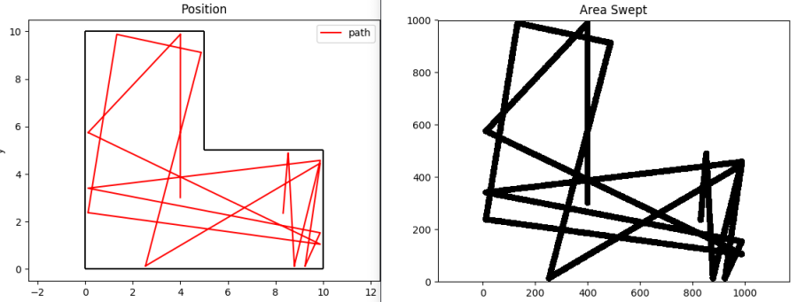

# Vacuum Simulator
This was part of a challenge I did for an interview. The idea is to simulate the performace of a robotic vacuum cleaner sweeping an L-shaped room. The robot drives in a straight line at a constant speed until it encounters a wall, upon which it chooses a new direction to travel. The new direction is chosen either completely at random, or via a slightly smarter algorithm, whereby a direction is twice as likely to be chosen if it is not yet swept.



## Usage 

### Time-based
Provide a starting position (m), heading (radians), and desired runtime (seconds). The simulation will compute the percent area of the room swept in that time. The simulation will also write its output to text files, which can be visualized using the script `plot_path.py`.

For example, to start the robot at (3.0, 4.0) with a heading of pi/2 and a run-time of 1000 seconds, use:
```
./main --time 3.0 4.0 1.57 1000
```
### Percent-based
Provide a desired percent to be swept, as well as a number of runs, N. The simulaton will run N times, starting the robot at a random position and heading each time. The average time to sweep the desired percent across N runs will be computed.

For example, to compute the average time to sweep 75% of the room across 10 runs, use:
```
./main --percent 75.0 10
```
